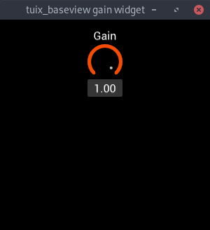

# tuix_baseview

[](https://github.com/geom3trik/tuix_baseview/blob/main/LICENSE)

A [`baseview`] backend for [`tuix`].

<div align="center">
    
</div>

## Simple Usage Example

```rust
use baseview::{Size, WindowOpenOptions, WindowScalePolicy};
use tuix_baseview::{RenderSettings, Settings, TuixWindow};

use tuix::events::BuildHandler;
use tuix::style::themes::DEFAULT_THEME;
use tuix::widgets::Button;

fn main() {
    let settings = Settings {
        window: WindowOpenOptions {
            title: String::from("tuix_baseview hello world"),
            size: Size::new(300.0, 110.0),
            scale: WindowScalePolicy::SystemScaleFactor,
        },
        clear_color: (0, 0, 0),
        render_settings: RenderSettings::default(),
    };

    TuixWindow::open_blocking(settings, |win_desc, state, window| {
        state.insert_theme(DEFAULT_THEME);

        Button::new().build(state, window, |builder| builder.set_text("Hello World!"));

        win_desc
    });
}
```

[`baseview`]: https://github.com/RustAudio/baseview
[`tuix`]: https://github.com/geom3trik/tuix